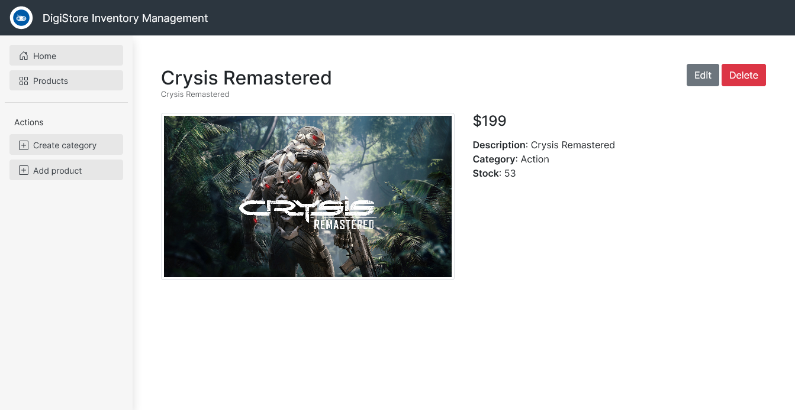
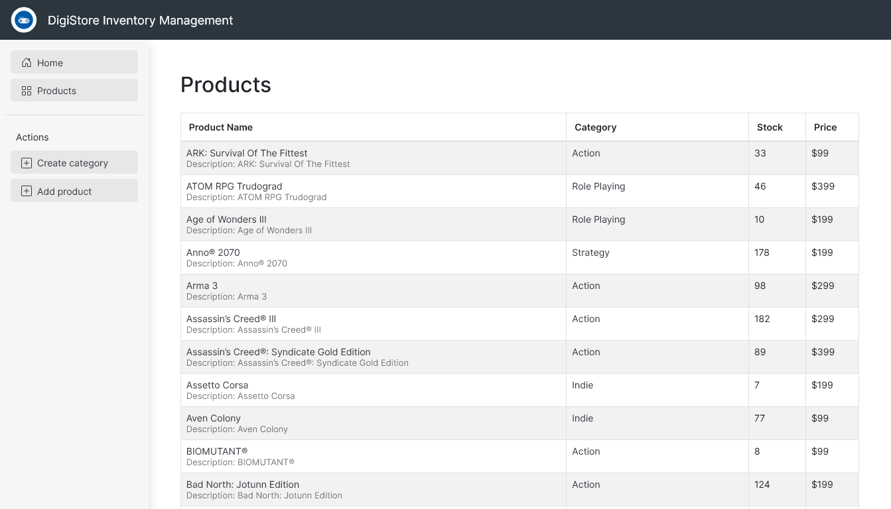

# Inventory Application

Store inventory management app using MongoDB, Express, and Node. Views are handled by [Pug](https://pugjs.org/api/getting-started.html).

The app has two basic models, Product and Category, each with their CRUD operations.

